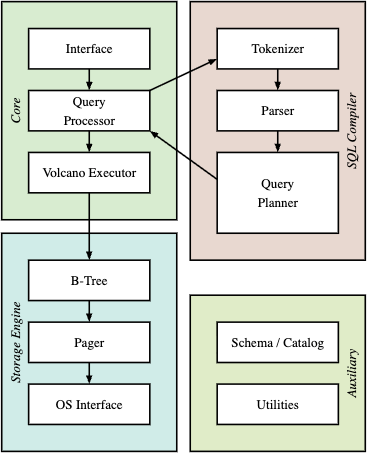

# InkDB

## A database engine in Rust

InkDB is a learning project built to explore how a relational database works, from SQL parsing through query execution and page storage. **It reads and writes SQLite database files and can also create files with its own header format**.

## Resources

These books, documentation pages, source code, and lectures informed the project:

- [SQLite Database System Design and Implementation](https://books.google.co.ma/books/about/SQLite_Database_System_Design_and_Implem.html?id=OEJ1CQAAQBAJ&redir_esc=y)
- [Database Internals](https://www.databass.dev/)
- [SQLite file format](https://sqlite.org/fileformat.html)
- [SQLite 3.0.0 source](https://sqlite.org/src/tree?ci=8b409aaae42cc36d)
- [CMU Introduction to Database Systems, Fall 2025](https://www.youtube.com/watch?v=7NPIENPr-zk&list=PLSE8ODhjZXjYMAgsGH-GtY5rJYZ6zjsd5)

## Install and run

The repository pins Rust 1.98.1 in `rust-toolchain.toml`. Rustup selects that toolchain when you run Rust commands here and installs it if needed.
This pin is the project's chosen toolchain, not a declared minimum supported Rust version.

```sh
cargo build --release
```

Open or create a database file and enter SQL in the shell:

```sh
cargo run --release -- users.db
```

For example, create a table, add a row, and read it back:

```sql
ink> CREATE TABLE users (id INTEGER PRIMARY KEY, name TEXT, age INTEGER);
ink> INSERT INTO users VALUES (1, 'Mira', 32);
ink> SELECT name, age FROM users;
Mira, 32
```

then

```sh
sqlite3 users.db
```

```sql
SELECT name, age FROM users;
Mira|32
```

The shell accepts statements ending in a semicolon. For a single query, pass it after the database path:

```sh
cargo run --release -- users.db "SELECT name FROM users;"
```

- The file extension selects the format when creating a database.
- Running `cargo run --release -- users.db` creates a SQLite format database.
- Running `cargo run --release -- users.inkdb` creates an InkDB format database with its own header.
- InkDB can open SQLite database files and writes `.db` files that remain readable by SQLite, within the SQL and file format features it supports.
- SQLite cannot open `.inkdb` files.

The catalog table is called `master` in InkDB. SQLite calls the equivalent table `sqlite_master`.

## Architecture



InkDB follows this layered architecture. At a high level, a query moves through `SQL → Planner → Executor → B-tree → Pager → Disk`. The image uses the labels “Code Generator” and “Virtual Machine” for its middle layers. InkDB handles those stages with a query planner and a Volcano style executor instead.

The SQL front end tokenizes and parses each statement before planning it. The executor pulls rows through its operators. B-tree operations read and write pages through the pager and VFS, which access the database file.

## How it works

InkDB uses a Volcano style execution model. Each operator asks its child for the next row, so a query plan produces rows as the parent pulls them. The parser builds a statement, the analyzer resolves names and checks it against the schema, and the planner connects operators for execution. The optimizer can use a row identifier or an index to narrow a scan.

```text
ink> EXPLAIN SELECT * FROM products WHERE category = 'Electronics' and price > 100.0 ORDER BY price ASC Limit 10;
Limit [limit: 10]
    Sort [i: 14]
        Filter [((category = 'Electronics') AND (price > 100))]
            IndexExactMatch [index_root: 9, table_root: 4, target: Electronics]
```

The storage layer uses B trees for table rows and indexes. A pager moves pages between the database file and memory, while a rollback journal supports transactions. Records use SQLite's serial type and variable length integer encoding. `ORDER BY` uses an external merge sort: when the sort data exceeds its memory budget, InkDB writes sorted runs to temporary files and merges them.

The SQL dialect is a subset of SQLite. Supported statements include `CREATE TABLE`, `CREATE INDEX`, `DROP TABLE`, `DROP INDEX`, `INSERT`, `SELECT`, `UPDATE`, `DELETE`, `BEGIN`, `COMMIT`, `ROLLBACK`, and `EXPLAIN`. The engine also supports expressions, constraints, `COUNT`, `WHERE`, one `ORDER BY` expression, and `LIMIT`.

## Limitations

SQLite compatibility applies to the file format and the SQL features InkDB implements.

- Joins and subqueries are not implemented.
- Indexes cover one column. Only the first column is used, so composite indexes such as `CREATE INDEX i ON users(firstname, lastname)` are not implemented.
- A query uses at most one index scan. Separate indexes are not combined to answer one `WHERE` clause.
- `ORDER BY` accepts one expression. For example, `ORDER BY age DESC` works, but `ORDER BY age, salary ASC` does not.
- Views, triggers, and `ALTER TABLE` are not implemented.
- `COUNT` is the only aggregate function, and grouped aggregation is not available.
- InkDB does not implement the full set of SQLite commands and pragmas.

## Future work

- [ ] Add join support.
- [ ] Add subquery support.
- [ ] Reduce allocations in record handling.
- [ ] Add composite indexes.
- [ ] Expand SQL support and improve query planning.

## Build and test

Build the project with:

```sh
cargo build --release
```

Run the test suite with:

```sh
cargo test --release
```

Many integration tests compare InkDB results with SQLite through rusqlite.

## Examples

The examples use the public Rust API and queries from the store workload you provided. They create their database on the first run and keep it for later runs.

```sh
cargo run --release --example store -- store.db
cargo run --release --example indexes -- indexes.db
cargo run --release --example transactions -- transactions.db
cargo run --release --example mutations -- mutations.db
cargo run --release --example constraints -- constraints.db
```

The store example creates customers, products, and orders, then runs filtered, sorted, and limited queries. The indexes example builds category and price indexes and prints plans for equality and range lookups. The transactions example shows a committed update and a rolled back update. The mutations example changes and deletes indexed rows. The constraints example shows rejected duplicate keys, duplicate emails, and null values in a required column. Use a `.inkdb` filename in place of `.db` to create a database with the InkDB header.

## License

InkDB is available under either the MIT License or the Apache License, Version 2.0. See [LICENSE-MIT](LICENSE-MIT) and [LICENSE-APACHE](LICENSE-APACHE).
